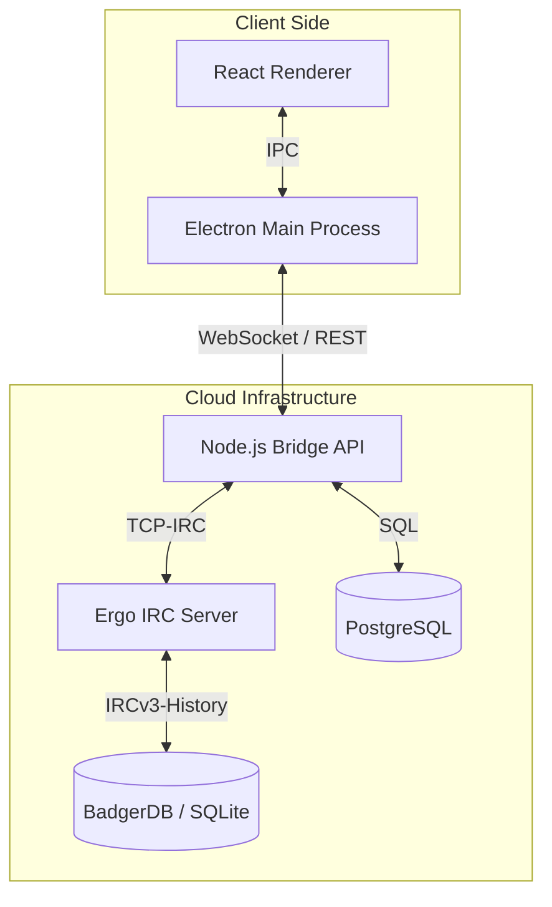

# IronCord

**IronCord** is a Discord-like desktop application built on an IRC backend. It bridges the gap between the stateless, text-only nature of IRC and the stateful, rich-media nature of modern chat platforms.

## 🏛 Architecture

IronCord follows a **Client-Gateway-Server** model:

1.  **Desktop Client (Frontend):** Electron + React. Handles UI rendering and state.
2.  **Gateway (Middleware):** Node.js. Maintains persistent TCP connections to the IRCd, manages HTTP uploads, and serves WebSocket events to the client.
3.  **Core (Backend):** Ergo IRCd. Handles message routing, presence, and channel state.
4.  **Persistence (DB):** PostgreSQL. Stores rich metadata not supported by IRC (Avatars, Attachments, Guild hierarchies).



## 🛠 Tech Stack

| Component | Technology |
| --- | --- |
| **Desktop Client** | [Electron](https://www.electronjs.org/) |
| **UI Framework** | [React](https://react.dev/) + [Tailwind CSS](https://tailwindcss.com/) |
| **API/Gateway** | [Node.js](https://nodejs.org/) (TypeScript) |
| **IRC Server** | [Ergo IRCd](https://github.com/ergochat/ergo) (Go) |
| **Database** | [PostgreSQL](https://www.postgresql.org/) |
| **State Management** | [Zustand](https://github.com/pmndrs/zustand) |

## 📁 Folder Structure

-   `apps/client`: Electron + React application.
-   `apps/gateway`: Node.js middleware bridge.
-   `infra/db`: PostgreSQL infrastructure (Podman/Docker).
-   `infra/ircd`: Ergo IRCd infrastructure (Podman/Docker).
-   `packages/shared`: Shared TypeScript types and utilities.

## 🚀 Setup & Installation

### Prerequisites

-   **Node.js** (v20+)
-   **Podman** (or Docker) and **podman-compose**

### 1. Infrastructure Setup

First, launch the core services (IRC Server and Database):

```bash
# Start IRC Server (Ergo)
cd infra/ircd && podman-compose up -d

# Start Database (PostgreSQL)
cd infra/db && podman-compose up -d
```

### 2. Gateway Setup

Install dependencies and start the gateway in development mode:

```bash
cd apps/gateway
npm install
npm run dev
```

### 3. Client Setup

Install dependencies and start the Electron application:

```bash
cd apps/client
npm install
npm start
```

## 🧩 Protocol Mapping (Guilds & Channels)

To emulate Discord "Servers" (Guilds) on a flat IRC network, IronCord utilizes **Namespace Prefixing**:

-   **Visual:** User sees Server "Gaming" -> Channel "#general"
-   **Protocol:** Client joins IRC Channel `&gaming-general`
-   **Metadata:** The `guilds` table in PostgreSQL maps the prefix `&gaming-` to the UI entity "Gaming Server".

## ✨ Core Features

-   **Modern Authentication:** Email/Password login flows utilizing SASL for the IRC connection.
-   **Guilds & Channels:** Discord-style server hierarchies mapped to IRC namespaces.
-   **Persistent History:** Leverages Ergo's `CHATHISTORY` extension to replay messages on connect.
-   **Real-time Communication:** Low-latency chat powered by WebSockets and IRCv3.
