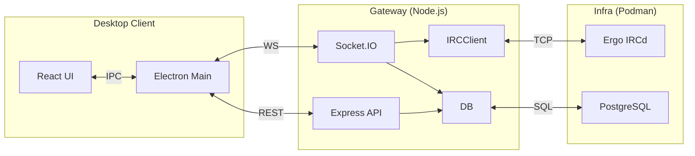

# IronCord

**IronCord** is a Discord-like desktop application built on an IRC backend. It bridges the gap between the stateless, text-only nature of IRC and the stateful, rich-media nature of modern chat platforms.

## 🏛 Architecture

IronCord follows a **Client-Gateway-Server** model:

1.  **Desktop Client:** Electron + React 19 + Tailwind v4 + Zustand.
2.  **Gateway (Middleware):** Node.js + Express 5 + Socket.IO. Bridges HTTP/WS to raw TCP IRC.
3.  **Core (Backend):** Ergo IRCd. Handles routing, presence, and history.
4.  **Persistence (DB):** PostgreSQL 15. Stores users, guilds, and channel metadata.



## 🛠 Tech Stack

| Component | Technology |
| --- | --- |
| **Monorepo** | NPM Workspaces |
| **Desktop Client** | [Electron Forge](https://www.electronforge.io/) + [Vite](https://vitejs.dev/) |
| **UI Framework** | [React 19](https://react.dev/) + [Tailwind CSS v4](https://tailwindcss.com/) |
| **API/Gateway** | [Node.js](https://nodejs.org/) + [Express 5](https://expressjs.com/) |
| **Real-time** | [Socket.IO](https://socket.io/) |
| **Database** | [PostgreSQL 15](https://www.postgresql.org/) |
| **Testing** | [Vitest](https://vitest.dev/) + [React Testing Library](https://testing-library.com/docs/react-testing-library/intro/) |

## 📁 Folder Structure

-   `apps/client`: Electron + React application.
-   `apps/gateway`: Node.js middleware bridge.
-   `packages/shared`: Shared TypeScript interfaces and DTOs.
-   `infra/db`: PostgreSQL 15 container config.
-   `infra/ircd`: Ergo IRCd container config.

## 🚀 Setup & Installation

### Prerequisites

-   **Node.js** (v20+)
-   **Podman** (or Docker) + **podman-compose**

### 1. Infrastructure Setup

```bash
# Start Core Services
cd infra/ircd && podman-compose up -d
cd ../db && podman-compose up -d
```

### 2. Build & Run

From the root directory:

```bash
# Install and build all workspaces
npm install
npm run build

# Start Gateway
cd apps/gateway && npm start

# Start Client
cd apps/client && npm start
```

## 🧪 Testing

Both Gateway and Client have comprehensive test suites using Vitest.

```bash
# Run all tests
npm test

# Run Gateway tests only
cd apps/gateway && npm test

# Run Client tests only
cd apps/client && npm test
```

## ✨ Core Features

-   **Modern Auth:** Email/Password registration with bcrypt hashing and JWT security.
-   **Guilds & Channels:** Discord-style server hierarchies mapped to IRC namespaces.
-   **Search & Discovery:** Real-time local message search for channel history.
-   **Member List:** Functional side panel showing online status and users.
-   **Interactive Elements:** Full support for stickers, gifts, and a built-in emoji picker.
-   **IRC Reconnection:** Automatic reconnection with exponential backoff for reliability.
-   **History Replay:** Leverages IRCv3 `CHATHISTORY` for seamless message replay.
-   **Premium UI:** Dark mode, glassmorphism, and Lucide icons for a premium feel.
-   **Type Safety:** Monorepo-wide type sharing via `@ironcord/shared`.
